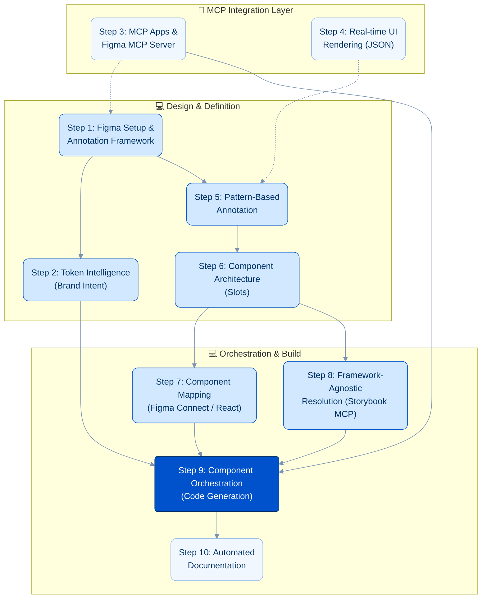

## Executive Summary

The year 2026 marks a significant evolution in design system management, shifting from the "Jack-of-all-trades" design team structures prevalent in 2023 to a highly integrated "Human + AI Pairing" model. This whitepaper introduces "The Agentic Design Workflow," an approach that leverages the Model Context Protocol (MCP) and advanced agentic reasoning to streamline the entire design-to-development lifecycle. By orchestrating AI with existing tools like Figma, Storybook, and Jira, this workflow shifts the design focus from creating static, high-fidelity mockups to defining system components, patterns, and annotations, which intelligent agents use to construct production-ready interfaces.

At the core of this approach are three interconnected MCP layers: the **Figma MCP Server** exposes design context to AI agents, **MCP Apps** render interactive review and configuration UIs directly inside AI conversations, and the **Storybook MCP** resolves design components to framework-specific code. Together, they form a continuous design system flow that replaces manual handoffs with an automated, bidirectional pipeline.

## The Problem Space

Traditional design and development workflows are plagued by inefficiencies stemming from disconnected tools, manual handoffs, and the constant need to translate design intent into production-ready code. Teams create full-blown designs and comprehensive workflows within Figma, making long-term management of design and UX artifacts incredibly difficult. In this "visual-first" approach, it becomes unclear to stakeholders what represents the latest truth, and deprecating old designs is a cumbersome, manual process.

This fragmentation leads to what we call the **"re-inventing the wheel" problem**: design components are meticulously crafted in design tools, only to be laboriously re-implemented by developers. Industry estimates suggest this traditional approach contributes to approximately **30% waste** in time and resources across the design-to-development lifecycle.

Design systems, while intended to solve this, often become rigid **"golden cages"**, systems too inflexible to adapt to evolving project needs and technology stacks. The absence of a seamless, bidirectional flow between design artifacts (Figma components, design tokens) and development assets (Storybook components, production code) creates friction, delays, and perpetual synchronization challenges. This is exacerbated in complex, multi-platform environments where consistency and rapid iteration are paramount yet frequently undermined by the very processes designed to ensure them.

## The Proposed Workflow (Step-by-Step)



### Step 1: Figma Setup & Annotation Framework

The foundational step involves importing the baseline design system into Figma **and establishing a robust annotation framework.** This isn't merely about visual assets; it's about **setting up a system of annotations—similar to how we currently handle Accessibility or SEO—to define design intent.** This framework allows designers to annotate spacing, gaps, font sizes, coloring, borders, and shadows (all managed via Tokens) directly on simplified layouts, rather than manually crafting every pixel for every state.

### Step 2: Token Intelligence

Building on the Figma setup, this step focuses on exporting semantic tokens from brand intent via a pipeline workflow. Design tokens, as defined by Holger Hellinger's insights, are the atomic units of a design system, encapsulating styling information (colors, typography, spacing, etc.). An intelligent pipeline, potentially augmented by AI, will extract and formalize these tokens from the Figma design system, ensuring consistency and enabling dynamic application across various platforms and technologies. This process moves beyond static values to semantic understanding, linking design decisions directly to their underlying brand principles.

### Step 3: MCP Apps & the Figma MCP Server

This step introduces the two MCP capabilities that make the agentic workflow possible. Understanding the distinction between them is critical.

#### The Figma MCP Server (Design Context Layer)

The **Figma MCP Server** is a standard MCP server that exposes design system data to AI agents. Available as both a remote hosted endpoint and a local desktop server, it provides three specialized agent skills:

* **Implement Design**: Select a Figma frame and generate code from it, respecting component structure and token values.
* **Code Connect Components**: Map Figma components to their code implementations, creating a bidirectional link between design and development.
* **Create Design System Rules**: Define and enforce design system constraints that agents must follow during code generation.

The Figma MCP Server is the **read side** of the workflow: it gives agents access to tokens, component metadata, layout structures, and Code Connect mappings.

#### MCP Apps (Interactive Review Layer)

**MCP Apps** are a fundamentally different capability. Released in January 2026 as the first official MCP extension (`@modelcontextprotocol/ext-apps`), they allow MCP servers to return **interactive UI components** that render directly inside AI conversations — in Claude, VS Code, ChatGPT, or any supporting MCP host.

Architecturally, an MCP App consists of two paired primitives:

1. **A standard MCP tool** that executes logic and returns results, with a `_meta.ui.resourceUri` field pointing to a UI resource.
2. **A UI Resource** served via the `ui://` scheme, containing bundled HTML/JavaScript that renders in a sandboxed iframe within the host application.

The host and the UI communicate bidirectionally via JSON-RPC over `postMessage`. The UI can receive tool results, call server tools, and maintain persistent state — all while the AI model stays informed of user interactions.

#### Why MCP Apps Matter for Design Systems

Where the Figma MCP Server lets agents *read* design context, MCP Apps let agents *present interactive interfaces* back to the user. This closes a critical gap in the continuous design flow:

* **Component inventory dashboards** — The agent queries the Figma MCP Server for component status, then renders an MCP App showing which components are Available, Partial, or Missing in Storybook, with interactive filtering and drill-down.
* **Token diff reviewers** — When design tokens change, an MCP App renders a visual before/after comparison inline in the conversation, allowing designers to approve or reject changes without leaving the AI workspace.
* **Pattern selection galleries** — Instead of the agent guessing which responsive pattern to apply, an MCP App presents a gallery of available patterns for the designer to select interactively, combining human judgment with agent execution.
* **Multi-step configuration wizards** — For complex component orchestration (see Step 9), an MCP App walks the user through slot configuration, theme selection, and responsive breakpoint choices as an interactive form.

#### The Continuous Design System Flow

Together, these layers form a continuous, bidirectional pipeline:

```text
Figma MCP Server → MCP Apps → Storybook MCP → Agent Assembly
  (read design)    (review/decide)  (resolve code)   (generate output)
```

The designer annotates in Figma. The agent reads context via the Figma MCP Server. An MCP App surfaces an interactive review for the designer to confirm or adjust. The agent then resolves the final components via Storybook MCP and assembles production code. At no point does the workflow require leaving the AI conversation or manually translating between tools.

### Step 4: Real-time UI Rendering

Leveraging concepts from Vercel Labs' `json-render`, this step focuses on rendering design intent (expressed as JSON schemas) directly into UI. Rather than working with static visual artifacts, designers and agents manipulate production-ready component schemas that render in real time.

This capability connects directly to the MCP layer: the Figma MCP Server provides the design context, the agent assembles a JSON schema from annotations and token values, and the rendering engine produces a live preview. MCP Apps can embed these previews inline in the AI conversation, allowing designers to see the result immediately and iterate without switching tools. The goal is to find the sweet spot between granular designer control and overall developer efficiency, focusing on production and high-fidelity use cases.

### Step 5: Pattern-Based Annotation

**Instead of letting AI or agents generate massive designs from specs that are difficult to consume or validate later, this workflow leverages Responsive Patterns and annotations.** Designers utilize these patterns to describe how maintained library components are utilized within a layout.
**Design and UX teams can focus on high-value annotations and "nice-to-haves" rather than repeatedly creating designs for multiple layouts.** The workflow is annotation-driven:

* **Responsive Patterns:** Define the structural behavior.
* **Token Annotations:** Define the styling (spacing, colors, etc.).
* **Logic Annotations:** Define the flow (e.g., "Split form if > 5 elements").

### Step 6: Component Architecture: Composition with Slots

To truly move from "drawing pages" to "orchestrating systems," the architecture of components themselves must evolve from rigid configurations to flexible compositions. This is achieved by adopting a **slot-based component architecture,** a concept recently highlighted by Figma as a path forward for modern design systems.

Instead of creating dozens of variants for a single component (e.g., `card-with-button`, `card-with-image`, `card-with-button-and-image`), a slot-based approach defines a single `card` component with designated "slots" where content like a header, media, or actions can be placed. This decouples the container from its content.

* **The Agentic Advantage:** This architecture is a powerful enabler for the agentic workflow. The designer's job is no longer to create every possible permutation of a component. Instead, they design flexible, "slottable" components and provide high-level annotations for a specific context. The agent then interprets these needs and intelligently "fills the slots" with the appropriate atomic components from the library. This drastically reduces redundant design work and directly addresses the "golden cage" problem described earlier.
* **Designer Empowerment:** By offloading the repetitive task of creating component variations to the agent, designers are freed to focus on higher-value work: designing new, robust base components, evolving system-wide patterns, and solving novel user experience challenges.

### Step 7: Component Mapping

A crucial step in bridging the design-development gap is ensuring that components within Figma are accurately mapped to their corresponding Storybook components via Figma Connect. This mapping is vital for the agent to correctly populate responsive patterns and templates with the right interactive elements. By establishing a robust, automated link, any updates or changes in the Figma design system can be reflected and validated directly within Storybook, maintaining synchronization and reducing discrepancies between design and code.

### Step 8: Framework-Agnostic Component Resolution

While Figma Connect facilitates mapping for React components, a significant portion of the digital landscape involves other frameworks (Vue, Angular, Svelte) or pure web components. For these, the agentic workflow relies on the **Storybook MCP**, a server that merges Storybook component metadata with Figma design context into a single rich context for the AI agent. The Storybook MCP can classify each component as Available, Partial, or Missing relative to the design system, providing the agent with a complete inventory regardless of the target framework. Combined with task context from ticketing systems (Jira, etc.), the agent can intelligently resolve and utilize the correct, framework-agnostic components. This ensures that the benefits of component orchestration extend beyond a single framework, providing comprehensive design system coverage.

### Step 9: Component Orchestration via MCP

This is where agentic reasoning truly shines. **MCP servers consume the Figma annotations as prompts, combining them with component documentation to generate the final UI.** An ideal workflow looks like this: The agent reads a prompt derived from annotations, such as: *"For this Registration form, only use pattern XYZ and the following form fields. Make sure to use Theme ABC and strip the form into steps when more than 5 form elements are needed on one form, except when only 1 form field is left on the second step."* The agent then maps these instructions to Storybook components and assembles the code automatically. This eliminates the need for visual mockups of every state, relying instead on the logic defined in the annotations.

### Step 10: Documentation

The ongoing maintenance of design system documentation is often a bottleneck. In this agentic workflow, documentation is not an afterthought but an integrated, continuous process. Through MCP-connected platforms like Jira or Confluence, agents can automatically generate, write, and update `.md` documentation based on changes in Figma, Storybook, or project requirements. This ensures that documentation remains current, accurate, and accessible, serving as a living repository of the design system's evolution.

## Tooling Roadmap

Implementing the Agentic Design Workflow requires assembling a concrete stack of MCP-compatible tools. The following table maps each layer of the continuous design flow to its current tooling:

1. **Design Context — Figma MCP Server** (Remote or Desktop): Exposes tokens, components, layouts, and Code Connect mappings to agents. Provides three agent skills: Implement Design, Code Connect Components, and Create Design System Rules.
2. **Interactive Review — MCP Apps** (`@modelcontextprotocol/ext-apps` SDK): Renders interactive dashboards, diff viewers, pattern galleries, and configuration wizards inside AI conversations (Claude, VS Code, ChatGPT, Goose).
3. **Code Resolution — Storybook MCP**: Merges Storybook component metadata with Figma design context. Classifies components as Available, Partial, or Missing. Provides framework-agnostic component inventory.
4. **Task Context — Jira / Confluence MCP adapters**: Supplies project requirements, task descriptions, and acceptance criteria to agents. Receives auto-generated documentation updates.
5. **Agent Orchestration — Instruction files, prompt templates, or dedicated agent engines** (e.g., Claude Agent SDK): Interprets design prompts, coordinates MCP server calls, and orchestrates component assembly and code generation.

Implementation should follow the phased adoption strategy (see Adoption & Scaling Strategy below), starting with the Figma MCP Server and progressively adding MCP Apps and Storybook MCP as the team's annotation practice matures.

## Case Studies & Examples

### Scenario 1: Annotation-Driven Form Creation

This scenario illustrates the shift away from creating complete, pixel-perfect designs in Figma towards a more efficient, annotation-oriented approach.

* **The Goal:** A complex multi-step registration form is needed.
* **Traditional Workflow:** A designer creates 10+ screens in Figma to show every validation state, error message, and step transition. These screens quickly become outdated as requirements change, and developers struggle to identify which screen is the "latest," making deprecation and management difficult.
* **Agentic Workflow:** The designer places a single "Form Container" component in Figma and applies a set of annotations:
    1. **Pattern:** "Multi-step Wizard Pattern"
    2. **Content:** List of required fields (Name, Email, Password, etc.)
    3. **Logic Annotation:** "Split into steps if fields > 5. Ensure final step has > 1 field."
    4. **Style Annotation:** "Use 'Compact' spacing token set."
    The MCP agent reads these annotations as a prompt. It fetches the "Wizard" pattern and the necessary form fields from Storybook. It applies the logic to split the fields into two steps and generates the code. No visual mockups for the separate steps were ever drawn in Figma; they were generated from the annotated intent.
* **Outcome:** Drastic reduction in design file size and maintenance overhead. The "source of truth" is the logic and annotation, not a static image.

### Scenario 2: System-Wide Brand Refresh and Theming

This scenario demonstrates the power of a token-based architecture when making global changes or introducing new themes.

* **The Goal:** The company is refreshing its brand with a new color palette and wants to introduce a dark mode.
* **Traditional Workflow:** A monumental manual task. Designers would spend days or weeks updating colors across hundreds of Figma files. Developers would then perform a search-and-replace for color values in the codebase, a process fraught with errors and inconsistencies. Creating a dark mode would involve writing extensive, hard-to-maintain CSS overrides.
* **Agentic Workflow:** The design system’s foundation is its token architecture. To implement the brand refresh, a designer simply updates the core color tokens. As all components are linked to these tokens, changes are propagated system-wide in an instant. For theming, a new set of "dark mode" tokens is created to overwrite the baseline. The agent can apply this new theme with a single command. If a responsive pattern itself needs an update (e.g., changing how a grid behaves on tablets), that single pattern is modified, and the agent ensures all components using it are correctly updated.
* **Outcome:** What traditionally took weeks of coordinated effort is now achievable in hours. The design system becomes a flexible, living entity. A simple color change is a minor configuration update, not a major project. New themes are no longer a daunting task but a simple extension of the existing token structure, allowing for rapid adaptation to new market or user requirements.

## Capability Amplification

The Agentic Design Workflow fundamentally amplifies the capabilities of design and engineering teams. By replacing manual handoffs with MCP-driven automation, leaner teams can achieve significantly higher output. This amplification stems from:

1. **Automation of Repetitive Tasks:** Agents handle the mundane and repetitive aspects of design system management, component assembly, and documentation, freeing up human talent for creative problem-solving and strategic initiatives.
2. **Reduced Handoff Friction:** The seamless, MCP-driven communication between design and development tools virtually eliminates traditional handoff issues, accelerating cycles and reducing rework.
3. **Enhanced Consistency & Quality:** By enforcing design system rules and leveraging predefined patterns and tokens, the workflow ensures a higher degree of consistency and quality across all digital products.
4. **Accelerated Iteration:** Designers and developers can iterate faster, test ideas more rapidly, and bring products to market with unprecedented speed.

## Adoption & Scaling Strategy: A Figma-First Approach

Adopting the Agentic Design Workflow is a strategic shift in process and mindset. It can be rolled out in managed phases, ensuring each step builds value and buy-in before advancing to the next level of automation. The focus begins in the design tool (Figma) and progressively expands into the development pipeline.

### Phase 1: Establishing Figma as the Source of Truth

Before any automation, the foundation must be solidified within Figma. The initial phase is dedicated to creating a well-structured design environment that is *ready* for an agent to understand.

* **Objectives:**
  * Establish a robust, semantic library of **design tokens**.
  * Build a comprehensive set of **atomic components** (atoms, molecules), leveraging **Figma Slots** to enhance their flexibility and reusability across diverse contexts without creating an explosion of variants.
  * Crucially, define and document a catalog of **responsive layout patterns** that govern how components are arranged on different viewports, making these patterns inherently more adaptable through the use of slots.
  * This foundational work itself can be accelerated by leveraging emerging AI design assistants within Figma to help generate, name, and organize these core assets.
* **Outcome:** A highly organized Figma environment becomes the single source of truth for the design system. Designers and developers begin referencing this structured system manually, moving away from ad-hoc design files. The organization learns to think in terms of systems and patterns, not just pages.

### Phase 2: Introducing Agent-Assisted Assembly & Prototyping

With the foundation in place, the agent is introduced as a powerful assistant to accelerate the design and feedback cycle. The designer's role officially shifts from creating static visuals to orchestrating systems.

* **Objectives:**
  * Designers stop creating pixel-perfect pages, instead composing layouts in Figma by combining components, applying responsive patterns, and adding **functional annotations** to define intent, behavior, and data needs.
  * An MCP-connected agent reads these annotated Figma files and **generates high-fidelity, code-based prototypes** automatically, using a technical component library that mirrors the Figma setup.
* **Outcome:** The loop between design intent and a working prototype is reduced from weeks to hours. The agent's ability to correctly interpret the designer's system-based instructions is validated, building trust in the workflow. The technical component library is built out in lockstep with the needs defined in Figma.

### Phase 3: Full Orchestration and Production Integration

In the final phase, the agent graduates from a prototyping assistant to a core orchestrator in the production pipeline. The workflow becomes a seamless, automated flow from design to deployment.

* **Objectives:**
  * The agent directly translates the annotated Figma specifications into **production-ready code**, creating pull requests for review by the development team.
  * The workflow expands beyond components to include tasks like **automated documentation updates**, where changes in Figma components or patterns trigger updates in Confluence or Markdown files.
* **Outcome:** The "Human + AI Pairing" model is fully realized. The design system is a living entity, with Figma as the undisputed source of intent and the agent as the tireless orchestrator, ensuring that what is designed is precisely what is built.

## Conclusion & Resources

The Agentic Design Workflow, powered by the Model Context Protocol and advanced AI reasoning, represents a paradigm shift in how we approach design and development. By fostering a truly integrated "Human + AI Pairing" model, we can overcome the inefficiencies of traditional processes, significantly reduce waste, and unlock unprecedented levels of creativity and productivity. This whitepaper has outlined a vision for a future where design systems are not static repositories but living, evolving entities orchestrated by intelligent agents.

## Referenced Resources

### MCP & Protocol

* **MCP Apps Announcement:** [MCP Apps — Bringing UI Capabilities to MCP Clients (Jan 2026)](https://blog.modelcontextprotocol.io/posts/2026-01-26-mcp-apps/)
* **MCP Apps Spec & SDK:** [Official ext-apps Repository (GitHub)](https://github.com/modelcontextprotocol/ext-apps)
* **MCP Apps Quickstart:** [Building Your First MCP App](https://modelcontextprotocol.github.io/ext-apps/api/documents/Quickstart.html)
* **MCP Apps in VS Code:** [Giving Agents a Visual Voice (VS Code Blog, Jan 2026)](https://code.visualstudio.com/blogs/2026/01/26/mcp-apps-support)

### Figma & Design Systems

* **Figma MCP Server:** [Developer Documentation](https://developers.figma.com/docs/figma-mcp-server/)
* **Figma MCP Blog:** [Introducing Our Dev Mode MCP Server](https://www.figma.com/blog/introducing-figma-mcp-server/)
* **Figma Slots:** [Schema 2025 — Design Systems for a New Era](https://www.figma.com/blog/schema-2025-design-systems-recap/#slots)
* **Storybook MCP Discussion:** [RFC — MCP Server Integration (GitHub)](https://github.com/storybookjs/storybook/discussions/31788)

### Design Patterns & Rendering

* **Responsive Patterns:** [Brad Frost — This Is Responsive](https://bradfrost.github.io/this-is-responsive/patterns.html)
* **Dynamic UI Rendering:** [Vercel Labs — JSON Render (GitHub)](https://github.com/vercel-labs/json-render)

### Research

* **Agentic AI:** [Agentic Reasoning for LLMs (arXiv)](https://arxiv.org/pdf/2601.12538)

### Experience Engineering Insights

* **Holger Hellinger’s Blog:** [Design Tokens & MCP](https://b.polente.de/blog/)
  * "Design Tokens — from bold vision to standard practice"
  * "Using MCP Servers for Design System Management"
  * "Escaping the Golden Cage of Design Systems"
