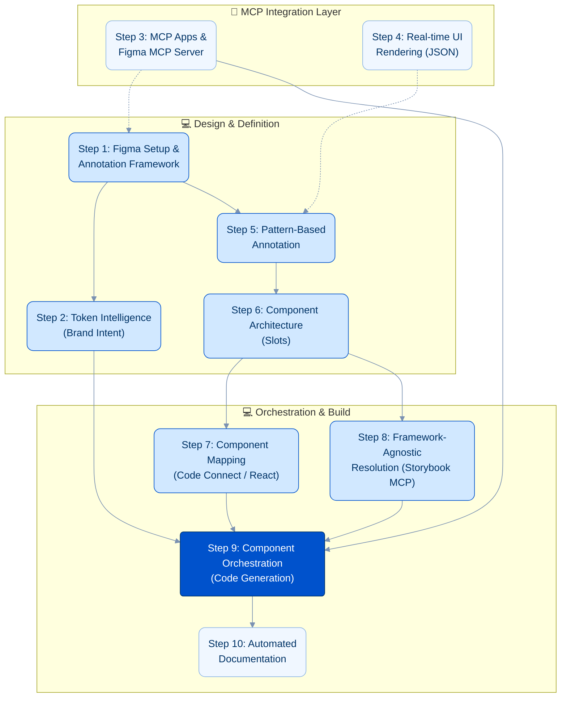

## Executive Summary

The year 2026 marks a big change in design system management. Teams move from the "Jack-of-all-trades" structures of 2023 to a "Human + AI Pairing" model. This post introduces "The Agentic Design Workflow". It uses the Model Context Protocol (MCP) and agentic reasoning across the whole design-to-development lifecycle. AI works with existing tools like Figma, Storybook, and Jira. The design focus shifts from static, high-fidelity mockups to system components, patterns, and annotations. Agents use these to build production-ready interfaces.

Three connected MCP layers sit at the core. The **Figma MCP Server** exposes design context to AI agents. **MCP Apps** render interactive review and configuration UIs directly inside AI conversations. The **Storybook MCP** resolves design components to framework-specific code. Together they form a continuous design system flow. An automated, bidirectional pipeline replaces manual handoffs.



## The Problem Space

Traditional design and development workflows lose time through disconnected tools, manual handoffs, and the constant translation of design intent into production code. Teams build full designs and complete workflows in Figma. This makes long-term management of design and UX artifacts very hard. In this "visual-first" approach, stakeholders cannot tell what the latest truth is. Deprecating old designs is slow manual work.

This leads to the **"re-inventing the wheel" problem**. Designers craft components in design tools. Developers then rebuild them by hand. Industry estimates suggest this approach causes about **30% waste** in time and resources across the design-to-development lifecycle.

Design systems should solve this. Often they become rigid **"golden cages"**: too inflexible to adapt to changing project needs and technology stacks. There is no bidirectional flow between design artifacts (Figma components, design tokens) and development assets (Storybook components, production code). This creates friction, delays, and constant sync work. It gets worse in complex, multi-platform environments. Consistency and fast iteration matter most there, yet the processes meant to protect them get in the way.

## The Proposed Workflow (Step-by-Step)


```mermaid
graph TD
    %% Cold Blue Technical Theme
    classDef banana fill:#D1E8FF,stroke:#0052CC,stroke-width:1px,color:#003366,rx:10,ry:10;
    classDef peel fill:#F0F7FF,stroke:#8EB6E6,stroke-width:1px,color:#003366,rx:10,ry:10;
    classDef stem fill:#0052CC,stroke:#003366,stroke-width:1px,color:#FFFFFF,rx:5,ry:5;

    subgraph Design_Phase ["💻 Design & Definition"]
        direction TB
        S1("Step 1: Figma Setup &<br/>Annotation Framework"):::banana
        S2("Step 2: Token Intelligence<br/>(Brand Intent)"):::banana
        S5("Step 5: Pattern-Based<br/>Annotation"):::banana
        S6("Step 6: Component Architecture<br/>(Slots)"):::banana

        S1 --> S2
        S1 --> S5
        S5 --> S6
    end

    subgraph Interaction_Phase ["🔄 MCP Integration Layer"]
        direction TB
        S3("Step 3: MCP Apps &<br/>Figma MCP Server"):::peel
        S4("Step 4: Real-time UI<br/>Rendering (JSON)"):::peel

        S3 -.-> S1
        S4 -.-> S5
    end

    subgraph Dev_Handoff ["💻 Orchestration & Build"]
        direction TB
        S7("Step 7: Component Mapping<br/>(Code Connect / React)"):::banana
        S8("Step 8: Framework-Agnostic<br/>Resolution (Storybook MCP)"):::banana
        S9("Step 9: Component Orchestration<br/>(Code Generation)"):::stem
        S10("Step 10: Automated<br/>Documentation"):::peel

        S6 --> S7
        S6 --> S8
        S7 --> S9
        S8 --> S9
        S9 --> S10
    end

    %% Connections between phases
    S2 --> S9
    S3 --> S9

    %% Link Styling
    linkStyle default stroke:#7B92B2,stroke-width:1px;
```

### Step 1: Figma Setup & Annotation Framework

The first step imports the baseline design system into Figma **and sets up a solid annotation framework.** This is not only about visual assets. **It is a system of annotations, similar to how we handle Accessibility or SEO today, that defines design intent.** Designers annotate spacing, gaps, font sizes, colors, borders, and shadows (all managed via Tokens) directly on simplified layouts. They no longer craft every pixel for every state.

### Step 2: Token Intelligence

This step exports semantic tokens from brand intent [via a pipeline workflow](/blog/ExperiencePipelinesExplained/). Design tokens are the atomic units of a design system. They hold styling information (colors, typography, spacing, etc.). A pipeline, possibly supported by AI, extracts and formalizes these tokens from the Figma design system. This keeps them consistent and usable across platforms and technologies. The process moves from static values to semantic meaning. Design decisions link directly to their brand principles.

### Step 3: MCP Apps & the Figma MCP Server

This step introduces the two MCP capabilities that make the agentic workflow possible. The difference between them matters.

#### The Figma MCP Server (Design Context Layer)

The **Figma MCP Server** is a standard MCP server. It exposes design system data to AI agents. It runs as a remote hosted endpoint or as a local desktop server, and it provides three agent skills:

* **Implement Design**: Select a Figma frame and generate code from it, respecting component structure and token values.
* **Code Connect Components**: Map Figma components to their code implementations, creating a bidirectional link between design and development.
* **Create Design System Rules**: Define and enforce design system constraints that agents must follow during code generation.

The Figma MCP Server is the **read side** of the workflow: it gives agents access to tokens, component metadata, layout structures, and Code Connect mappings.

#### MCP Apps (Interactive Review Layer)

**MCP Apps** are a different capability. They were released in January 2026 as the first official MCP extension (`@modelcontextprotocol/ext-apps`). They let MCP servers return **interactive UI components** that render directly inside AI conversations: [in Claude, VS Code, ChatGPT](/blog/SuperchargeVSCodeWithMCPServersAndAgentMode/), or any supporting MCP host.

Architecturally, an MCP App consists of two paired primitives:

1. **A standard MCP tool** that executes logic and returns results, with a `_meta.ui.resourceUri` field pointing to a UI resource.
2. **A UI Resource** served via the `ui://` scheme, containing bundled HTML/JavaScript that renders in a sandboxed iframe within the host application.

The host and the UI talk to each other via JSON-RPC over `postMessage`. The UI can receive tool results, call server tools, and keep state. The AI model stays informed of user interactions.

#### Why MCP Apps Matter for Design Systems

The Figma MCP Server lets agents *read* design context. MCP Apps let agents *present interactive interfaces* back to the user. This closes a gap in the continuous design flow:

* **Component inventory dashboards:** The agent queries the Figma MCP Server for component status. Then it renders an MCP App that shows which components are Available, Partial, or Missing in Storybook, with interactive filtering and drill-down.
* **Token diff reviewers:** When design tokens change, an MCP App renders a visual before/after comparison in the conversation. Designers approve or reject changes without leaving the AI workspace.
* **Pattern selection galleries:** The agent does not guess which responsive pattern to apply. An MCP App shows a gallery of available patterns, and the designer picks one. Human judgment meets agent execution.
* **Multi-step configuration wizards:** For complex component orchestration (see Step 9), an MCP App walks the user through slot configuration, theme selection, and responsive breakpoints as an interactive form.

#### The Continuous Design System Flow

Together, these layers form a continuous, bidirectional pipeline:

```text
Figma MCP Server → MCP Apps → Storybook MCP → Agent Assembly
  (read design)    (review/decide)  (resolve code)   (generate output)
```

The designer annotates in Figma. The agent reads context via the Figma MCP Server. An MCP App surfaces an interactive review for the designer to confirm or adjust. The agent then resolves the final components via Storybook MCP and assembles production code. At no point does the workflow require leaving the AI conversation or manually translating between tools.

### Step 4: Real-time UI Rendering

This step builds on concepts from Vercel Labs' `json-render`. It renders design intent (expressed as JSON schemas) directly into UI. Designers and agents no longer work with static visual artifacts. They work with production-ready component schemas that render in real time.

This connects directly to the MCP layer. The Figma MCP Server provides the design context. The agent builds a JSON schema from annotations and token values. The rendering engine produces a live preview. MCP Apps can embed these previews in the AI conversation, so designers see the result right away and iterate without switching tools. The goal is the sweet spot between designer control and developer efficiency, with a focus on production and high-fidelity use cases.

### Step 5: Pattern-Based Annotation

**AI or agents should not generate massive designs from specs that are hard to consume or validate later. This workflow uses Responsive Patterns and annotations instead.** Designers use these patterns to describe how library components sit within a layout.
**Design and UX teams can focus on high-value annotations and "nice-to-haves" instead of creating designs for multiple layouts again and again.** The workflow is annotation-driven:

* **Responsive Patterns:** Define the structural behavior.
* **Token Annotations:** Define the styling (spacing, colors, etc.).
* **Logic Annotations:** Define the flow (e.g., "Split form if > 5 elements").

### Step 6: Component Architecture: Composition with Slots

To move from "drawing pages" to "orchestrating systems," the components themselves must change from rigid configurations to flexible compositions. The answer is a **slot-based component architecture,** a concept Figma recently highlighted as a path forward for modern design systems.

Instead of creating dozens of variants for a single component (e.g., `card-with-button`, `card-with-image`, `card-with-button-and-image`), a slot-based approach defines a single `card` component with designated "slots" where content like a header, media, or actions can be placed. This decouples the container from its content.

* **The Agentic Advantage:** This architecture enables the agentic workflow. The designer no longer creates every possible permutation of a component. Instead, they design flexible, "slottable" components and add high-level annotations for a specific context. The agent reads these needs and "fills the slots" with the right atomic components from the library. This cuts redundant design work and addresses the "golden cage" problem described earlier.
* **Designer Focus:** The agent takes over the repetitive work of creating component variations. Designers can focus on higher-value work: designing new, solid base components, evolving system-wide patterns, and solving new user experience problems.

### Step 7: Component Mapping

A key step between design and development is mapping Figma components to their Storybook components via Figma Code Connect. The agent needs this mapping to fill responsive patterns and templates with the right interactive elements. With a solid, automated link, updates in the Figma design system show up and get validated directly in Storybook. Design and code stay in sync.

### Step 8: Framework-Agnostic Component Resolution

Code Connect handles mapping for React components. But much of the web runs on other frameworks (Vue, Angular, Svelte) or [pure web components](/blog/WebComponents/). For these, the agentic workflow relies on the **Storybook MCP**. This server merges Storybook component metadata with Figma design context into one rich context for the AI agent. The Storybook MCP classifies each component as Available, Partial, or Missing relative to the design system. The agent gets a complete inventory regardless of the target framework. Combined with task context from ticketing systems (Jira, etc.), the agent can resolve and use the correct framework-agnostic components. The workflow then covers more than one framework.

### Step 9: Component Orchestration via MCP

This is where agentic reasoning pays off. **MCP servers consume the Figma annotations as prompts and combine them with component documentation to generate the final UI.** An ideal workflow looks like this. The agent reads a prompt derived from annotations, such as: *"For this Registration form, only use pattern XYZ and the following form fields. Make sure to use Theme ABC and strip the form into steps when more than 5 form elements are needed on one form, except when only 1 form field is left on the second step."* The agent then maps these instructions to Storybook components and assembles the code. No visual mockups of every state are needed. The logic lives in the annotations.

### Step 10: Documentation

Design system documentation is often a bottleneck. In this workflow, documentation is part of the process, not an afterthought. Through MCP-connected platforms like Jira or Confluence, agents generate and update `.md` documentation based on changes in Figma, Storybook, or project requirements. Documentation stays current, accurate, and accessible. It becomes a living record of how the design system evolves.

## Tooling Roadmap

The Agentic Design Workflow needs a concrete stack of MCP-compatible tools. The following list maps each layer of the continuous design flow to its current tooling:

1. **Design Context: Figma MCP Server** (Remote or Desktop): Exposes tokens, components, layouts, and Code Connect mappings to agents. Provides three agent skills: Implement Design, Code Connect Components, and Create Design System Rules.
2. **Interactive Review: MCP Apps** (`@modelcontextprotocol/ext-apps` SDK): Renders interactive dashboards, diff viewers, pattern galleries, and configuration wizards inside AI conversations (Claude, VS Code, ChatGPT, Goose).
3. **Code Resolution: Storybook MCP**: Merges Storybook component metadata with Figma design context. Classifies components as Available, Partial, or Missing. Provides framework-agnostic component inventory.
4. **Task Context: Jira / Confluence MCP adapters**: Supplies project requirements, task descriptions, and acceptance criteria to agents. Receives auto-generated documentation updates.
5. **Agent Orchestration: Instruction files, prompt templates, or dedicated agent engines** (e.g., Claude Agent SDK): Interprets design prompts, coordinates MCP server calls, and runs component assembly and code generation.

Implementation should follow the phased adoption strategy (see Adoption & Scaling Strategy below). Start with the Figma MCP Server. Add MCP Apps and Storybook MCP as the team's annotation practice matures.

## Case Studies & Examples

### Scenario 1: Annotation-Driven Form Creation

This scenario illustrates the shift away from creating complete, pixel-perfect designs in Figma towards a more efficient, annotation-oriented approach.

* **The Goal:** A complex multi-step registration form is needed.
* **Traditional Workflow:** A designer creates 10+ screens in Figma to show every validation state, error message, and step transition. These screens go out of date quickly as requirements change. Developers struggle to find the "latest" screen, which makes deprecation and management hard.
* **Agentic Workflow:** The designer places a single "Form Container" component in Figma and applies a set of annotations:
    1. **Pattern:** "Multi-step Wizard Pattern"
    2. **Content:** List of required fields (Name, Email, Password, etc.)
    3. **Logic Annotation:** "Split into steps if fields > 5. Ensure final step has > 1 field."
    4. **Style Annotation:** "Use 'Compact' spacing token set."
    The MCP agent reads these annotations as a prompt. It fetches the "Wizard" pattern and the necessary form fields from Storybook. It applies the logic to split the fields into two steps and generates the code. No visual mockups for the separate steps were ever drawn in Figma; they were generated from the annotated intent.
* **Outcome:** Much smaller design files and less maintenance. The "source of truth" is the logic and annotation, not a static image.

### Scenario 2: System-Wide Brand Refresh and Theming

This scenario shows what a token-based architecture does for global changes and new themes.

* **The Goal:** The company is refreshing its brand with a new color palette and wants to introduce a dark mode.
* **Traditional Workflow:** A huge manual task. Designers would spend days or weeks updating colors across hundreds of Figma files. Developers would then search and replace color values in the codebase, which leads to errors and inconsistencies. A dark mode would need extensive, hard-to-maintain CSS overrides.
* **Agentic Workflow:** The design system’s foundation is its token architecture. To implement the brand refresh, a designer updates the core color tokens. As all components are linked to these tokens, the pipeline propagates the changes system-wide. The agent creates a pull request for review by the development team. For theming, a new set of "dark mode" tokens is created to overwrite the baseline. The agent can apply this new theme with a single command. If a responsive pattern needs an update (e.g., changing how a grid behaves on tablets), only that pattern changes. The agent makes sure all components using it are updated.
* **Outcome:** What took weeks of coordinated effort now takes hours. The design system becomes flexible and alive. A color change is a small configuration update, not a major project. A new theme is a simple extension of the existing token structure, not a big task. Teams can adapt quickly to new market or user requirements.

## Capability Amplification

The Agentic Design Workflow amplifies what design and engineering teams can do. MCP-driven automation replaces manual handoffs, so smaller teams can deliver much more. This comes from:

1. **Automation of Repetitive Tasks:** Agents handle the repetitive parts of design system management, component assembly, and documentation. People get time for creative problem-solving and strategic work.
2. **Reduced Handoff Friction:** MCP-driven communication between design and development tools removes most traditional handoff issues. Cycles get faster and rework drops.
3. **Enhanced Consistency & Quality:** Design system rules, predefined patterns, and tokens keep consistency and quality high across all digital products.
4. **Accelerated Iteration:** Designers and developers iterate faster, test ideas sooner, and ship products faster.

## Adoption & Scaling Strategy: A Figma-First Approach

Adopting the Agentic Design Workflow changes process and mindset. Roll it out in managed phases. Each phase builds value and buy-in before the next level of automation. The focus starts in the design tool (Figma) and then expands into the development pipeline.

### Phase 1: Establishing Figma as the Source of Truth

Before any automation, the foundation must be solidified within Figma. The initial phase is dedicated to creating a well-structured design environment that is *ready* for an agent to understand.

* **Objectives:**
  * Build a solid, semantic library of **design tokens**.
  * Build a complete set of **atomic components** (atoms, molecules). Use **Figma Slots** to make them flexible and reusable across contexts without an explosion of variants.
  * Define and document a catalog of **responsive layout patterns**. They govern how components are arranged on different viewports. Slots make these patterns more adaptable.
  * Emerging AI design assistants in Figma can speed up this work. They help generate, name, and organize the core assets.
* **Outcome:** A well-organized Figma environment becomes the single source of truth for the design system. Designers and developers start to reference this system manually instead of ad-hoc design files. The organization learns to think in systems and patterns, not just pages.

### Phase 2: Introducing Agent-Assisted Assembly & Prototyping

With the foundation in place, the agent joins as an assistant that speeds up the design and feedback cycle. The designer's role shifts from creating static visuals to shaping systems.

* **Objectives:**
  * Designers stop creating pixel-perfect pages. They compose layouts in Figma by combining components, applying responsive patterns, and adding **functional annotations** to define intent, behavior, and data needs.
  * An MCP-connected agent reads these annotated Figma files and **generates high-fidelity, code-based prototypes** automatically, using a technical component library that mirrors the Figma setup.
* **Outcome:** The loop from design intent to a working prototype drops from weeks to hours. This shows whether the agent reads the designer's system-based instructions correctly, and it builds trust in the workflow. The technical component library grows in step with the needs defined in Figma.

### Phase 3: Full Orchestration and Production Integration

In the final phase, the agent moves from prototyping assistant to a core part of the production pipeline. The workflow becomes an automated flow from design to deployment.

* **Objectives:**
  * The agent directly translates the annotated Figma specifications into **production-ready code**, creating pull requests for review by the development team.
  * The workflow expands beyond components to include tasks like **automated documentation updates**, where changes in Figma components or patterns trigger updates in Confluence or Markdown files.
* **Outcome:** The "Human + AI Pairing" model is complete. The design system is alive. Figma is the source of intent, and the agent does the tireless assembly work. What is designed is what gets built.

## Conclusion & Resources

The Agentic Design Workflow, powered by the Model Context Protocol and AI reasoning, changes how we approach design and development. A real "Human + AI Pairing" model removes the inefficiencies of traditional processes and cuts waste. Design systems stop being static repositories. They become living, evolving systems that agents help maintain.

## Referenced Resources

### MCP & Protocol

* **MCP Apps Announcement:** [MCP Apps: Bringing UI Capabilities to MCP Clients (Jan 2026)](https://blog.modelcontextprotocol.io/posts/2026-01-26-mcp-apps/)
* **MCP Apps Spec & SDK:** [Official ext-apps Repository (GitHub)](https://github.com/modelcontextprotocol/ext-apps)
* **MCP Apps Quickstart:** [Building Your First MCP App](https://modelcontextprotocol.github.io/ext-apps/api/documents/Quickstart.html)
* **MCP Apps in VS Code:** [Giving Agents a Visual Voice (VS Code Blog, Jan 2026)](https://code.visualstudio.com/blogs/2026/01/26/mcp-apps-support)

### Figma & Design Systems

* **Figma MCP Server:** [Developer Documentation](https://developers.figma.com/docs/figma-mcp-server/)
* **Figma MCP Blog:** [Introducing Our Dev Mode MCP Server](https://www.figma.com/blog/introducing-figma-mcp-server/)
* **Figma Slots:** [Schema 2025: Design Systems for a New Era](https://www.figma.com/blog/schema-2025-design-systems-recap/#slots)
* **Storybook MCP Discussion:** [RFC: MCP Server Integration (GitHub)](https://github.com/storybookjs/storybook/discussions/31788)

### Design Patterns & Rendering

* **Responsive Patterns:** [Brad Frost: This Is Responsive](https://bradfrost.github.io/this-is-responsive/patterns.html)
* **Dynamic UI Rendering:** [Vercel Labs: JSON Render (GitHub)](https://github.com/vercel-labs/json-render)

### Research

* **Agentic AI:** [Agentic Reasoning for LLMs (arXiv)](https://arxiv.org/pdf/2601.12538)

### Experience Engineering Insights

* **Holger Hellinger’s Blog:** [Design Tokens & MCP](/blog/)
  * [Design Tokens: from bold vision to standard practice](/blog/DesignTokensAreFinalNow/)
  * [Using MCP Servers for Design System Management](/blog/MCPServerInDesignSystemWorkflows/)
  * [Escaping the Golden Cage of Design Systems](/blog/EmbracingTheFreedomOfCustomExperiencePipelines/)
